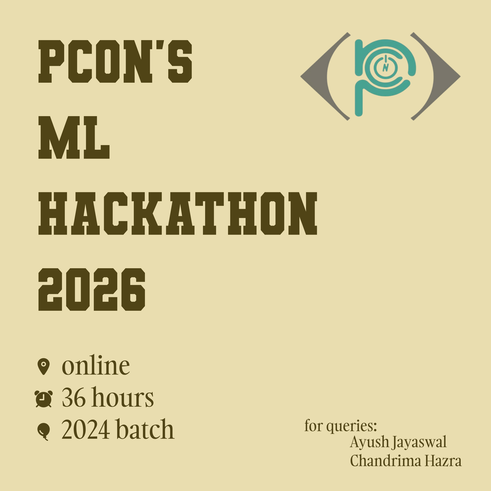

# Winners
| Position | Name | Reg. No. |
|-|-|-|
| 1st 🥇 | Tushar Das | 2024UGCS088 |
| 2nd 🥈 | Arpit Saraswat | 2024UGCM025 |
| 3rd 🥉 | Tanishk Pandey | 2024UGCS037 |

For CTF round; Harsh Sahu (2024UGCS057) is the winner

# Organisers
 The Event was organised by following members of PCON:
 * Ayush Jayaswal
 * Chandrima Hazra

# Leaderboard
## For ML
|roll_id|name|p1_score|p1_attempts|p2_score|p2_attempts|total_score|
|--------|------|----------|-------------|----------|-------------|-------------|
|2024UGCM025|Arpit Saraswat |5738.56|2|9185.29|3|14923.85|
|2024UGCS088|Tushar Das|5720.16|3|9200.97|2|14921.14|
|2024UGCS037|Tanishk|5743.08|3|9162.44|3|14905.52|
|2024UGEC057|Harsh Sahu|5662.46|3|8881.59|3|14544.04|
|2024UGCS058|Gautam|5676.06|3|8796.28|3|14472.34|
|2024UGEE033|Shreya Rastogi|5654.76|3|8736.21|1|14390.97|
|2024UGCS047|Shambhawi Singh|5656.57|2|8496.62|3|14153.18|
|2024UGCS044|Aditya Raj|5757.44|3|8257.78|2|14015.22|
|2024UGPI020|Yash Chawla|5676.06|2|8320.06|3|13996.13|
|2024UGPI010|RAMAKANT|5676.06|1|8320.06|1|13996.13|
|2024UGCS113|HImanshu Gupta|5667.94|2|8239.63|2|13907.57|
|2024UGEC108|Sunny Singh|5620.34|2|8198.19|2|13818.53|
|2024UGME013|KALI |5663.24|2|8007.21|3|13670.45|
|2024UGEC107|Sameer Kumar|5725.75|1|7924.19|1|13649.94|
|2024UGCS066|Swayam Agarwal|5642.71|3|7874.38|3|13517.08|
|2024UGEE025|Ashish Kumar|5374.7|2|8011.71|3|13386.41|
|2024UGCS083|Aashu Anand|5117.95|2|8002.69|2|13120.64|
|2024UGCS030|Piyush Kumar|5665.48|2|7196.58|2|12862.05|
|2024UGCE080|Sandeep|5238.2|1|7605.36|1|12843.57|
|2024UGEC054|Nikhil Thakur|5624.47|1|3728.65|3|9353.12|
|2024UGEC008|Nikhil Pathak|0.0|0|8111.43|2|8111.43|
|2024UGMM035|bandana singh|5676.06|1|0.0|0|5676.06|
|2024UGME063|Akshat Kumar|5480.88|1|0.0|0|5480.88|
|2024UGEC051|Aryan|5143.7|1|0.0|0|5143.7|
|2024UGCS089|Abhinov kanojiya|4238.76|2|0.0|0|4238.76|

## For CTF
|roll_id|name|p1_score|p1_attempts|p2_score|p2_attempts|total_score|
|--------|------|----------|-------------|----------|-------------|-------------|
|2024UGEC057|Harsh Sahu|10000.0|1|10000.0|1|20000.0|
|2024UGCS037|Tanishk|0|3|10000.0|1|10000.0|
|2024UGCS088|Tushar Das|0|3|10000.0|2|10000.0|
|2024UGCS113|Himanshu Gupta|10000.0|1|0.0|0|10000.0|
